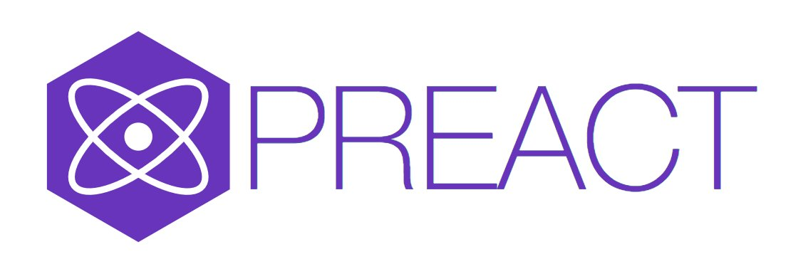

I recently finished a personal project written in Preact. This post is about my experience writing
a progressive web app using preact for the front end and firebase for the backend.

## From Polymer to Preact

At my work we use Polymer for all of our apps. We have built nearly a dozen or so apps in both polymer 1 & 2. For my personal project I wanted to use a different framework. I had read up on Preact and wanted to
get some hands on experience with it so I chose that for the front end. The app I ended up writing was 
[Story Time With Friends](https://www.storytimewithfriends.com). It lets users login through Facebook and write stories in a round robin fashion where they can only see the entry right before their own.

### Failures

##### UI Library
I will start with the main part of this app that I failed on... That is the UI Library I chose to integrate with. I did not do enough research when I chose Material UI as the library to use. It is beautiful as hell but also pretty heavy. Here I am using a minimalistic and sweet framework like Preact but I am bloating my bundle like nobody's business just with UI Components. If I were to redo the front end I would definitely pick a lightweight alternative.

##### Redux
I probably used Redux too early and when I did use it I didn't use it enough to make it worth it. All I needed was the share a user object amongst a handful of views. Without thinking I just through Redux at it (like most people on the internet will tell you). I either should have never implemented it and used a different solution for state management or I should have gone in 100% and built some kind of service that held all of my api logic and stored all of my state in redux.

>None of these limitations are required to build an app, with or without React. In fact these are pretty strong constraints, and you should think carefully before adopting them even in parts of your app.
>
 -Dan Abramov [You Might Not Need Redux](https://medium.com/@dan_abramov/you-might-not-need-redux-be46360cf367)

I found Dan Abramov's article a bit too late. It seems everyone else on the internet will sell you Redux for any and every solution to state probs..

##### Composition
I failed horribly at composition this time around. Towards the end of development of my MVP (minimum viable product) I found several places where I should have componetized things better. Composition is super important. When I revisit this app in the future I plan to refactor several things into components that are easier to read and reason about.

##### Routing / Login Flow
Login redirects caused me more frustration than it probably should have. In future apps with a third party sign in I plan to architect a better flow. My final solution ended up working pretty well but it took far too many attempts than it should have. 

### Successes

##### The Product
I am extremely pleased with how the app turned out. Even with the extra bloat it scores relatively well on
Lighthouse. The game ended up being pretty fun to play. I think I made the right call using Preact. I
used Preact-CLI which made development fast af. Deployment was really easy. I was able to finish this app
in roughly 2 months of working on it mainly on weekends and some nights. This was with no experience with React or Preact. Literally made all my dreams come true xD. There were plenty of resources and helpful information on using Preact.

##### Firebase
 Firebase was a good choice for my backend because it gave me sockets and realtime updates with not a lot of configuration. It was a bit different to use than other database solutions but my coworker Anthony cleared up any questions I had about structuring my data, which is really the only difficult part of using firebase. They also gave me Facebook Authentication for free. Shortly after finishing Google released their new FireStore platform that I am probably going to check out for future projects.

### Would I Use Preact Again
Hell to the yes. After using Polymer and Preact I will say that I am positive I will be using Preact for my future side projects. I may have to come back and reevaluate this once Polymer 3 is released but for now I am more than happy to develop in Preact.

### PWA Perks

1.  Excellent performance
2.  Relatively easy to develop with the write tools
3.  Feels native especially since they are deeply integrated into android os
4.  Push notifications greatly enhanced UX for this type of app

Thanks for reading.
Please feel free to check out my app and hit me up with any questions!

> kaseyjameshinton@gmail.com